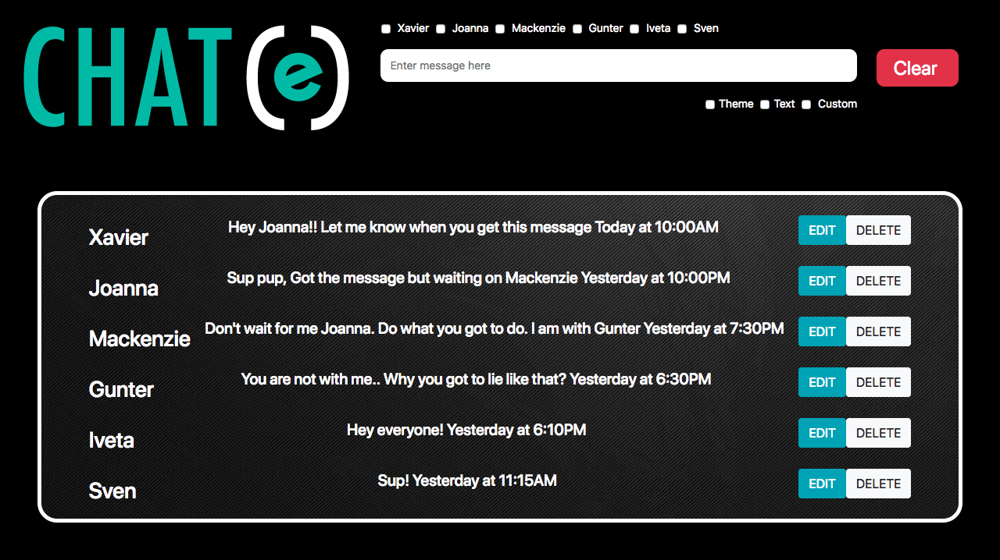

## Chat(e)
Chat(e) is an internal messaging application where users can craft messages within a community setting via a shared message board. Add, edit and delete existing messages, or clear the entire populated message list in a flash. With the click of a button you can adjust your theme on the fly, enlarge your text or even pick from 5 pre programmed custom themes.  

## Technologies Used
* Bootstrap 4
* HTML
* CSS
* Javascript

## How to Run
1. Go to: `https://www.npmjs.com/package/http-server` and install "http-server".  
2. Navigate to the project folder in command line interface and type: `http-server -p 8080`  
3. This will show at: `http://localhost:8080` in your internet browser.  
